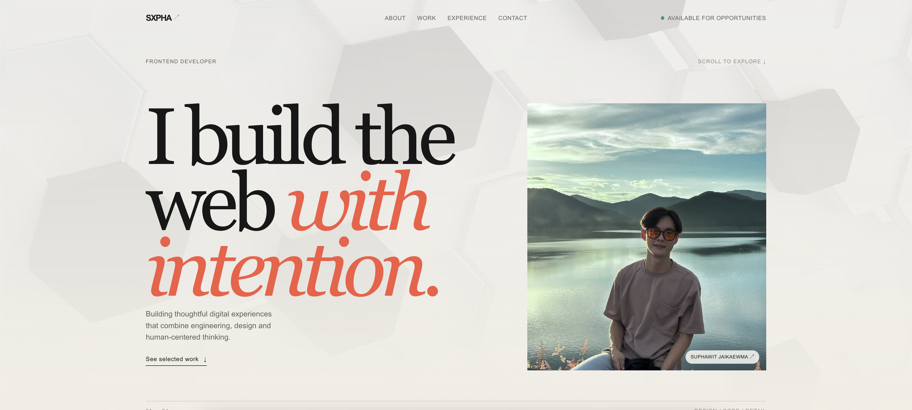

# ssxphawit - Portfolio by Suphawit Jaikaewma

An editorial, interactive portfolio for Suphawit Jaikaewma — a frontend developer focused on building clear, responsive, and thoughtful digital experiences.

The site is designed for recruiter scanning first, with restrained motion, project storytelling, responsive layouts, and a visual system that can grow with real portfolio content.

🔗 **Live Demo:** [https://ssxphawit.vercel.app](https://ssxphawit.vercel.app/)


## 📸 Describe the system screen. (Screenshots)


## ✨ Highlightss

- Responsive portfolio layout for desktop, tablet, and mobile
- Interactive hero with seamless video background
- Selected work and all-work project index
- Individual project detail pages with technology tags and project highlights
- Scroll-reveal sections and scroll-driven experience chapters
- Bento-style About section
- Animated technology marquee using icons from `public/tools`
- English-first content and accessible navigation
- Reduced-motion support for users who prefer less animation
- Data-driven project and experience content stored separately from components

## 🛠 Tech stack
- **Frontend:** Next.js, TypeScript, Tailwind CSS
- **Deployment:** Vercel
- **Agent:** Codex

## 🚀 Getting started
### Requirements
- Node.js 20.9 or newer
- npm

### Install dependencies
```bash
npm install
```

### Start the development server
```bash
npm run dev
```

Open [http://localhost:3000](http://localhost:3000) in your browser.

### Available scripts
```bash
npm run dev      # Start the local development server
npm run lint     # Run ESLint
npm test         # Run the Node test suite
npm run build    # Create a production build
npm run start    # Start the production server
```

## Routes
| Route | Purpose |
| --- | --- |
| `/` | Main portfolio page with hero, about, work, experience, and contact sections |
| `/work` | Full project index |
| `/work/[slug]` | Project detail page generated from the project data |

## Content management
Project content lives in [`data/projects.json`](./data/projects.json). Add or update a project there rather than hard-coding project details in a component.

Each project includes fields such as:

```json
{
  "slug": "project-slug",
  "title": "Project title",
  "category": "Web application",
  "year": "2026",
  "role": "Frontend developer",
  "summary": "A short project summary.",
  "description": "A longer project description.",
  "image": "/projects/project-image.png",
  "imageAlt": "Description of the project visual",
  "technologies": ["React", "TypeScript"],
  "highlights": []
}
```

Experience content is stored in [`data/experience.json`](./data/experience.json). Images and other static assets belong in [`public/`](./public/), with project images in [`public/projects/`](./public/projects/) and technology icons in [`public/tools/`](./public/tools/).

## Project structure
```text
app/                  Next.js routes, layout, metadata, and global styles
components/           Reusable portfolio sections and UI components
data/                 JSON content for projects and experience
lib/                  Data access, font configuration, and small utilities
public/               Images, icons, video, and downloadable assets
types/                Shared TypeScript data types
docs/superpowers/     Design specifications and implementation plans
```

## Deployment
Create a production build locally before deployment:

```bash
npm run build
npm run start
```

## 💡 Key Learnings
- Using AI Agent.
- Studying systems architecture / state management / performance improvement.
- Resolving technical issues encountered in the project.

## 👤 License
This is a personal portfolio project. The source code and visual assets are intended for personal use and are not licensed for redistribution without permission.
